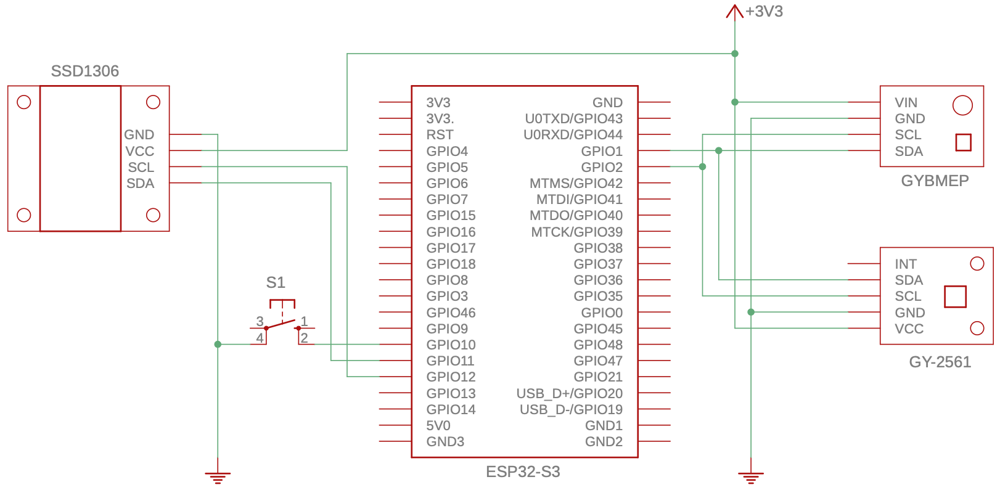

| Supported Targets | ESP32 | ESP32-C3 | ESP32-S2 | ESP32-S3 |
| ----------------- | ----- | -------- | -------- | -------- |
# Lab 3

This lab is based on...

## How to Use Example

Before project configuration and build, be sure to set the correct chip target using `idf.py set-target esp32-s3`.

### Hardware Required

* An ESP32-S3-DevKitC-1 development board
* A USB cable for microcontroller power supply and programming
* SSD1306 128x64 pixel I2C OLED display
* GYBMEP BME280 I2C digital temperature/humidity/pressure sensor
* GY-2561 TSL2561 I2C digital luminosity sensor 
* A solderless breadboard
* Jumper or Dupont wires (M/M, M/F) to connect components

Additional hardware used for lab exercise:

* NO pushbutton

Schematic:


### Build and Flash

Run `idf.py -p PORT flash monitor` to build, flash and monitor the project.

(To exit the serial monitor, type ``Ctrl-]``.)

See the [Getting Started Guide](https://docs.espressif.com/projects/esp-idf/en/latest/get-started/index.html) for full steps to configure and use ESP-IDF to build projects.

Alternatively, this project can be developed using [VSCode](https://code.visualstudio.com) with the [PlatformIO IDE](https://platformio.org/platformio-ide) extension and the [Espressif 32 platform](https://registry.platformio.org/platforms/platformio/espressif32) installed.

## Example Output

```
I (287) app_start: Starting scheduler on CPU0
I (292) app_start: Starting scheduler on CPU1
I (292) main_task: Started on CPU0
I (302) main_task: Calling app_main()
I (312) lab3: Found TSL2561 in package T/FN/CL
I (312) lab3: Initialize I2C 1
I (312) lab3: CONFIG_SDA_GPIO=11
I (322) lab3: BMP280: found BME280
I (322) lab3: CONFIG_SCL_GPIO=12
I (322) main_task: Returned from app_main()
I (322) lab3: Initialize 128x64 SSD1306 display
I (342) SSD1306: OLED configured successfully
I (1312) lab3: Illuminance: 123 Lux, Pressure: 98697.06 Pa, Temperature: 20.47 C, Humidity: 35.45
I (2312) lab3: Illuminance: 123 Lux, Pressure: 98693.03 Pa, Temperature: 20.47 C, Humidity: 35.29
I (3312) lab3: Illuminance: 122 Lux, Pressure: 98693.70 Pa, Temperature: 20.47 C, Humidity: 35.14
I (4312) lab3: Illuminance: 123 Lux, Pressure: 98694.14 Pa, Temperature: 20.48 C, Humidity: 34.97
```

## Exercise

Load the example code and confirm that the sensors and OLED display are working properly. Use the IDF Monitor or Serial Studio to observe the values from the sensors and confirm that they change as expected. Also confirm that the test display on the OLED display is working. Once the example is working properly, modify the example code to add the following functionality:

1. 

### Other Things to Explore
1.

