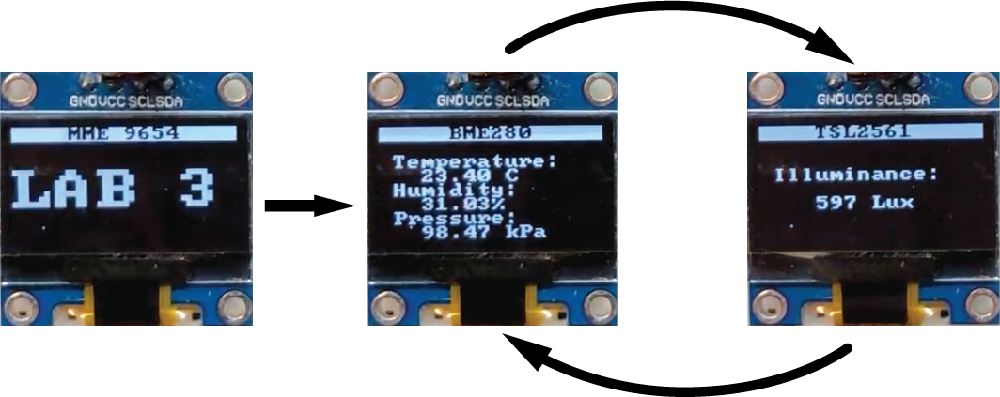
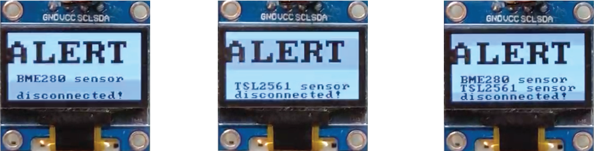

| Supported Targets | ESP32 | ESP32-C3 | ESP32-S2 | ESP32-S3 |
| ----------------- | ----- | -------- | -------- | -------- |
# Lab 3

This lab explores the use of the I2C (Inter-Integrated Circuit) serial communication bus. First introduced in 1982 by Philips Semiconductors, it is widely used for connecting peripherals to microcontrollers when data rates are relatively low. I2C uses only two bidirectional data lines: one for data (SDA) and one for a clock (SCL). The SDA and SCL lines are active low, so they should be pulled up with resistors (these are typically included on sensor modules). The standard I2C bus speed is 100 kbit/s and the fast mode is 400 kbit/s. The reference design utilizes a 7-bit address space. Multiple devices can share a single bus, with one master devices connecting with one or more slaves. Slaves on the same bus must use different addresses. The ESP32-S3 has two [I2C controllers](https://docs.espressif.com/projects/esp-idf/en/latest/esp32s3/api-reference/peripherals/i2c.html) built in, allowing two separate buses to operate. Other background information on the standard can be found [here](https://www.i2c-bus.org/i2c-primer/).

The provided example code is derived from several other examples, allowing two I2C sensor modules and an I2C OLED display to be used. These are:

[**GYBMEP**](https://protosupplies.com/product/bme280-i2c-pressure-humidity-temperature-sensor-module/) This sensor module includes a [BME280](https://www.mouser.ca/datasheet/2/783/bst_bme280_ds002-2238172.pdf) environmental sensor that can measure temperature, humidity, and temperature. The module supports two different I2C slave addresses, allowing up to 2 sensors to be used on the same bus. As shipped, the default address is 0x76. A trace between pads on the board next to the BME280 chip grounds the SDO pin. To change the I2C address to 0x77, cut the trace connecting the two pads and solder the other two pads together to pull the SDO pin high. Further details (focused on an Arduino implementation) may be found [here](https://lastminuteengineers.com/bme280-arduino-tutorial/). The example code is based on [this code](https://github.com/UncleRus/esp-idf-lib/tree/master/examples/bmp280/default).

[**GY-2561**](https://okystar.com/wp-content/uploads/2017/07/OKY3250.pdf) This sensor module includes a [TSL2561](https://cdn-shop.adafruit.com/datasheets/TSL2561.pdf) luminosity sensor to measure light intensity in the visible and near-infrared region of the electromagnetic spectrum. The TSL2561 supports three possible slave I2C addresses: 0x29, 0x39, or 0x49. This means you can have up to three TSL2561s attached to a single I2C bus. The address used by the part is determined by the solder jumper labeled "ADDR". When there is no solder on the jumper, the TSL2561 will use the default address of 0x39. Additional information about the TSL2561 is contained in [this page](https://learn.sparkfun.com/tutorials/tsl2561-luminosity-sensor-hookup-guide) for a Sparkfun module. The example code is based on [this code](https://github.com/UncleRus/esp-idf-lib/tree/master/examples/tsl2561/default).

[**SSD1306**](https://cdn-shop.adafruit.com/datasheets/SSD1306.pdf) This module incorporates a 128 x 64 pixel OLED display and an I2C display controller. The default slave address is 0x3C, as the OLED address select pins marked 0x78 have been connected. The address can be changed to 0x3D by moving the 4.7 kΩ resistor to the pins marked 0x7A. Further details 
(for an Arduino implementation) may be found [here](http://robotcantalk.blogspot.com/2015/03/interfacing-arduino-with-ssd1306-driven.html) and [here](http://robotcantalk.blogspot.com/2015/03/interfacing-arduino-with-ssd1306-driven_9.html). The example code is based on [this code](https://github.com/nopnop2002/esp-idf-ssd1306).

Note that in the example code, the sensors operate on one I2C bus (0) and the OLED display on another (1). While it is possible to run all devices on the same bus, the I2C master initialization code for the sensors and display are incompatible as written.

## How to Use Example

Before project configuration and build, be sure to set the correct chip target using `idf.py set-target esp32-s3`.

### Hardware Required

* An ESP32-S3-DevKitC-1 development board
* A USB cable for microcontroller power supply and programming
* SSD1306 128x64 pixel I2C OLED display
* GYBMEP BME280 I2C digital temperature/humidity/pressure sensor
* GY-2561 TSL2561 I2C digital luminosity sensor 
* A solderless breadboard
* Jumper or Dupont wires (M/M, M/F) to connect components

Additional hardware used for lab exercise:

* NO pushbutton

Schematic:


### Build and Flash

Run `idf.py -p PORT flash monitor` to build, flash and monitor the project.

(To exit the serial monitor, type ``Ctrl-]``.)

See the [Getting Started Guide](https://docs.espressif.com/projects/esp-idf/en/latest/get-started/index.html) for full steps to configure and use ESP-IDF to build projects.

Alternatively, this project can be developed using [VSCode](https://code.visualstudio.com) with the [PlatformIO IDE](https://platformio.org/platformio-ide) extension and the [Espressif 32 platform](https://registry.platformio.org/platforms/platformio/espressif32) installed.

## Example Output

```
I (287) app_start: Starting scheduler on CPU0
I (292) app_start: Starting scheduler on CPU1
I (292) main_task: Started on CPU0
I (302) main_task: Calling app_main()
I (312) lab3: Found TSL2561 in package T/FN/CL
I (312) lab3: Initialize I2C 1
I (312) lab3: CONFIG_SDA_GPIO=11
I (322) lab3: BMP280: found BME280
I (322) lab3: CONFIG_SCL_GPIO=12
I (322) main_task: Returned from app_main()
I (322) lab3: Initialize 128x64 SSD1306 display
I (342) SSD1306: OLED configured successfully
I (1312) lab3: Illuminance: 123 Lux, Pressure: 98697.06 Pa, Temperature: 20.47 C, Humidity: 35.45
I (2312) lab3: Illuminance: 123 Lux, Pressure: 98693.03 Pa, Temperature: 20.47 C, Humidity: 35.29
I (3312) lab3: Illuminance: 122 Lux, Pressure: 98693.70 Pa, Temperature: 20.47 C, Humidity: 35.14
I (4312) lab3: Illuminance: 123 Lux, Pressure: 98694.14 Pa, Temperature: 20.48 C, Humidity: 34.97
```

## Exercise

Load the example code and confirm that the sensors and OLED display are working properly. Use the IDF Monitor or Serial Studio to observe the values from the sensors and confirm that they change as expected. Also confirm that the test display on the OLED display is working. Once the example is working properly, modify the example code to add the following functionality:

1. Display the MME 9654 Lab 3 startup screen on the OLED display for 3 seconds upon power up or reset. Then use the OLED to display the sensor readings. The display should alternate between displaying the current temperature (ºC), humidity (%), and pressure (kPa) from the BME280 sensor, and the current illuminosity reading (lux) from the TSL2561 sensor. The data from each sensor should display for 2 seconds before switching. Note that since the sensor data is being displayed on the screen, you may choose to stop sending sensor data to the serial monitor—it is your choice.


2. Add a pushbutton to the circuit, nominally connected to GPIO10 (you may choose to use a different pin). After startup, the pushbutton should change the operating mode with each press, cycling back from 3 to 1.

  | Operating Mode | Description                    |
  |----------------|--------------------------------|
  | 1              | BME280 data only               |
  | 2              | TSL2561 data only              |
  | 3              | Toggle BME280 and TSL2561 data |

3. Add code that, after startup, can detect when one or both sensors has become disconnected. The display should change to indicate that an error has occurred and provide information about which sensor(s) are disconnected.


4. Use the addressable Smart LED that is integrated into the ESP32-S3-DevKitC-1 board (connected to GPIO48) to indicate the current display mode. The LED should remain on unless the system is operating in Mode 3 (toggle data display), in which case it should blink on and off while still showing the colour associated with the display mode. You may use code that is similar to what you used for Lab 2 to drive the addressable LED strip, although it may be simpler to use the minimal RMT-based code in the ESP-IDF  [Blink](https://github.com/espressif/esp-idf/tree/master/examples/get-started/blink) example.

| Display Mode | Colour |
|--------------|--------|
| Startup      | White  |
| BME280       | Green  |
| TSL2561      | Cyan   |
| Alert        | Red    |

### Other Things to Explore
1. Correct the relative air pressure reading to account for current altitude. See information [here](https://www.mide.com/air-pressure-at-altitude-calculator). 
2. Add a potentiometer or second pushbutton to control the toggle rate of the display.
3. Explore the use of other display patterns and/or graphic elements to improve the way that sensor data is presented on the OLED display.
4. Update the SSD1306 I2C initialization code to allow all devices to operate on a single I2C bus. As a starting point, see the information and examples [here](https://github.com/UncleRus/esp-idf-lib/blob/master/docs/porting.md).
